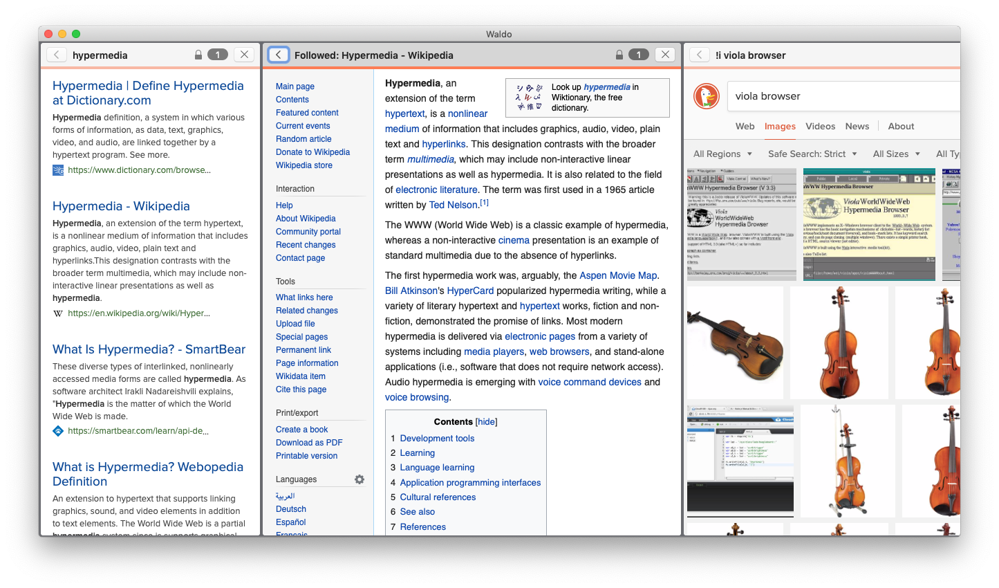

#  Waldo — an Experimental Hypermedia Environment
Waldo is a Web browser for MacOS. Its goal is to serves as a testbed for
features that empower users to use hypermedia resources for their specific tasks
at hand, rather than being constrained to use resources only as the creator of
the resource intended.

*Important! This is very experimental, untested code. Please do not use for
anything sensitive or critical!*

## Motivation

The Web browser landscape today looks very homogeneous — tabbed browsing, a
combined search and address bar, bookmarks. Aside from small differences here
and there, there's really very little between the various offerings. A general
trend has been to give Web developers increasing control over the way that their
work appears, and a reduction in the features available to users. Is this a one
way movement, or can the pendulum swing back the other way?

It wasn't always this way — in the early days of the Web there was a wide
variety of experiments in what browsers should look like, and many of them were
motivated by empowering end-users. Waldo aims to bring back some of that
speculative experimentation. As such, don't expect any feature to stay too still
— the way that Waldo works today may be very different from the way it works
tomorrow!

Some of the long-term goals of Waldo are:
* alleviate tab hoarding and information overload with more powerful ways of
  surfacing resources which are timely or useful
* de-emphasise individual resources, instead allowing users to compose or
  combine them as appropriate to their needs
* push back on increasingly siloed Web apps by unbundling layers of
  functionality
* enable the read-write Web.

Note that Waldo is intended to be a hypermedia environment, rather than just a
Web browser. For the time being, the Web and hypermedia are largely synonymous,
but hopefully Waldo will allow for broader experimentation in this space as
well.

## UI Model

In the Waldo model, all activity takes places in workspaces (currently limited
to one). Resources open in panels, which are arranged horizontally. This model
was inspired by [10/GUI](http://10gui.com) and [Desktop
Neo](https://desktopneo.com), although there are also parallels with early
hypermedia efforts (even as far back as [Bush's
Memex](https://en.wikipedia.org/wiki/Memex)) which established side-by-side
comparative browsing as a powerful feature.

There is no address or search bar within a panel. Instead, you open the
workspace's task bar (which intentionally looks a lot like the Spotlight
popover). There is much more planned for the task bar than just an address bar
replacement — this will be the main focus of upcoming releases.

Instead of the usual favicon, title, URL combination at the top of a resource,
Waldo shows you the context of this resource. There are two parts to the
context: the intent — why you got to this resource — and the reliability of the
resource.

The original purpose of the intent was to reorient a user when they returned to
a resource after spending time on another task. However, it turned out to have
some interesting security properties as well — including potential protection
from [Tabnapping](https://en.wikipedia.org/wiki/Tabnabbing) and the [Line of
Death](https://textslashplain.com/2017/01/14/the-line-of-death/).

The reliability information is currently very limited, simply whether the
connection is encrypted and how many times the site has been visited. There are
more features planned for this area, which is a nuanced and complicated one.

## Keybindings

Waldo tries to conform to keybindings from common Web browsers as much as
possible:
* Cmd+T to show the task bar — entering a URL or search query opens the
  requested resource in a new panel
* Cmd+W to close a panel (Ctrl+Shift+T to reopen the last opened panel)
* Cmd+D to centre a panel
* Cmd+Shift+{ / } to move panel focus left or right

## Contributors

Waldo is MIT licensed and welcomes any contributors — as an experimental
environment there's little that's not in scope!

However, there are a few things to note. Firstly, it's worth starting a
conversation here on GitHub or on [Twitter](https://twitter.com/auxilit) as
there may be features planned or already in flight which overlap or conflict.

Secondly, Waldo is an experiment which will have a finite life span. At some
point, Waldo will be frozen, and the lessons learned will be used to inspire
something new. Please bear that in mind before deciding to commit to a
contribution!
